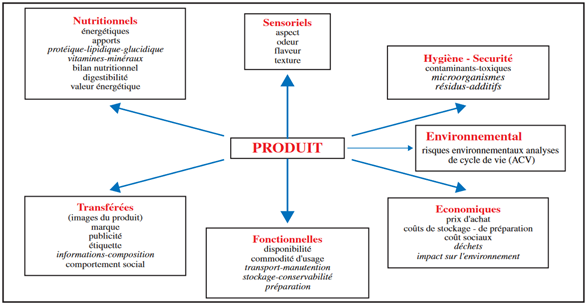

# L'aliment du bétail de qualité{#qualite}

##	Éléments de définition

La **qualité** de l'aliment est un mot clé qui sous-tend le recours et la mise en œuvre des procédés. C'est une notion que tout le monde comprend de manière intuitive, mais qui reste difficile à définir de manière universelle.

La **qualité** est l'aptitude d'un produit à **satisfaire** ses **utilisateurs** (_définition AFNOR_). C’est l’ensemble des propriétés et caractéristiques d'un service ou d'un produit qui lui confère l'aptitude à satisfaire des besoins exprimés ou implicites de tous les utilisateurs (_définition plus complète ISO_).

Dans l’alimentation humaine, la qualité des aliments est décrite par [**six**](https://www.nelinkia.com/blog/lexique/definition-qualite-alimentaire.html) ou **huit** composantes (_selon les auteurs_) qui sont indépendantes les unes des autres. Ces composantes sont parfois formulées par **4 S + 2 R + T + E** ou par **SSSS RR TE** se déclinant selon les **attentes du consommateur et de l’utilisateur**.

Ce qu’attend le **consommateu**r :

-	**Sécurité** (_qualité hygiénique_) : on veut des dangers en moins ;

-	**Santé** (_qualité nutritionnelle_) : on veut des atouts en plus ;

-	**Saveur** (_qualité organoleptique_) : on veut se faire plaisir ;

-	**Service** (_qualité d'usage_) : on veut que ce soit commode ;

-	**Régularité** (_qualité constante_) : on ne veut pas de surprise ;

-	**Rêve** (_qualités transférées_) : on mange des symboles ;

Ce qu’attend l’**utilisateur** :

-	**Technologie**, attentes des autres utilisateurs : 

>> 
-	Transformateurs ;
-	Distributeurs.

-	**Ethique**, prise en compte « des autres » :

>>
-	Générations futures : durable ;
-	Petits producteurs locaux : local ;
-	Pays du tiers-monde : équitable ;
-	Bien-être animal.

**Figure 2.1** La qualité d’un produit est multifactorielle selon [Leverve (2010)](https://www.mediachimie.org/sites/default/files/chimie_alimentation_53.pdf)

Voici quelques composantes :

###	Composante (ou qualité) nutritionnelle

La qualité nutritionnelle est reliée, d'une part, à la présence d'éléments nutritifs essentiels (acides aminés essentiels, acides gras insaturés, fibres alimentaires, micronutriments tels que les vitamines, les antioxydants, les minéraux, les substances bioactives) et, d'autre part, à leur biodisponibilité.

Ces constituants doivent être contenus dans le régime en quantité suffisante pour répondre aux besoins d’entretien et de production.

###	Composante (ou qualité) sanitaire

La qualité sanitaire ou hygiénique inclue tout ce qui touche à la sécurité alimentaire, au point de vue chimique et bactériologique.

Les aliments apportés peuvent concentrer des constituants indésirables tels que les résidus de pesticides, les nitrates, les métaux lourds, les mycotoxines, les résidus de médicaments vétérinaires, les germes pathogènes et les parasites ou les allergènes.

###	Qualité sensorielle ou organoleptique

La composante sensorielle ou organoleptique correspond à l'ensemble des propriétés d'un produit perçues par les organes des cinq sens, liées à la fois au produit et à la capacité de perception sensorielle qu'en ont les sujets. Elle est caractérisée par l'aspect (couleur et forme), l'odeur, la saveur, les arômes et la texture.

Ce critère défini l’appétibilité de l’aliment et le coefficient d’encombrement.

###	Qualité d'usage

Il s'agit des qualités technologiques de l’aliment ou des ingrédients en vue de la transformation domestique, artisanale ou industrielle. Ses principaux critères sont le comportement dans les différents modes de cuisson, le rendement après le procédé, la conservation ou la conservabilité, le prix, le temps de préparation.

##	Rappel des bonnes pratiques de composition d’aliments

La préparation des aliments composés est réalisée en plusieurs étapes, à savoir :

-	**Pesée** des matières premières : elle doit être précise ;

-	**Mouture** : les matières premières fines (particules de 0.1 à 1.5 mm) peuvent être incorporés telles quelles dans le mélange (_phosphore, craie, lysine, méthionine, CMV, sons, etc._), les autres éléments de la ration (_céréales, tourteaux, etc._) doivent être broyés avant d’être mélangés pour obtenir des particules grossières de 0.5 à 1.5 mm ;

-	**Pré-mélange** : il consiste à mélanger toutes les matières premières que l’on doit incorporer en faibles quantités avec une partie des céréales moulues, de manière à mieux les répartir dans le mélange final. Le pré mélange peut être réalisé simplement dans des bassines ou dans un tonneau désaxé mis en mouvement au mayen d’une manivelle (exemple : craie, phosphore, lysine, méthionine, CMV + une partie de maïs) ; 

-	**Mélang**e : le pré-mélange est incorporé progressivement au reste des matières premières à l’aide d’un mélangeur (_mélangeur subhorizontal, vertical, tonneau désaxé, etc._) ou à la pelle sur surface bétonnée ;

-	**Incorporation d’huile** : elle est réalisée en dernier lieu, progressivement et après un certain temps de mélange pour éviter la formation de petites boulettes ;

-	Utiliser toujours des **matières premières de qualité** (_éviter moisissures, terre, corps étrangers, etc._) ;

-	**Peser correctement** les matières premières ;

-	Vérifier s’il n’y a pas de pertes au niveau du broyage, sinon réaliser la pesée des matières premières après mouture ;

-	Eviter les pertes au niveau des pré-mélanges ;

-	Incorporer progressivement le pré-mélange dans le mélange ;

-	Incorporer **en dernier lieu les matières grasses**, de manière progressive et après avoir mélangé le reste pendant 10 minutes au moins ;

-	Respecter les temps de mélange recommandés par les fabricants de mélangeurs (_de 20 à 30 min_) ;

-	Vérifier la bonne répartition des ingrédients après avoir réalisé le mélange ;

-	Utiliser toujours une main-d’œuvre qualifiée et expérimentée pour la préparation des aliments ;

-	Lors de la fabrication, éviter la propagation des maladies d’un bâtiment à l’autre (_grandes exploitations_) par l’intermédiaire des sacs réutilisés : marquage et utilisation des **sacs par bâtiment** ;

-	Pour la même raison, utiliser des **sacs neufs** pour les provendes et les remplacer régulièrement.

##	Tenue de registres aux fins de la traçabilité

La tenue d’un registre fait partie des exigences en matière de qualité ([ACIA, 2014b](https://www.inspection.gc.ca/sante-des-animaux/aliments-du-betail/consultations/identification-des-dangers-des-aliments-du-betail/fra/1399399411768/1399399412471#a31)). Les fabricants d’aliments destinés aux animaux devraient :

-	**Tenir un registre comprenant :** 

> la formule de l'aliment, y compris le nom et le poids de tous les ingrédients utilisés dans la fabrication de chaque lot de l'aliment ;

> une feuille de mélange indiquant que chaque lot de l'aliment a été fabriqué conformément à la formule de l'aliment ;

> des renseignements indiquant si l'aliment contient ou non une substance interdite ;

> la date de préparation de l'aliment ;

> tout renseignement permettant d'identifier chaque lot de l'aliment, notamment le numéro du lot ; et

> les nom et adresse de toute personne à qui l'aliment est distribué ou vendu et une description de l'aliment, y compris son nom et sa quantité ;

-	**s'assurer que toute personne qui importe, emballe, entrepose, distribue, vend ou annonce pour la vente un aliment pour animaux conserve :**

> tout renseignement permettant d'identifier l'aliment, notamment son nom et le numéro du lot ;

> le nom et l’adresse de toute personne à qui l'aliment est distribué ou vendu et une description de l'aliment, y compris son nom et sa quantité ; et

> une description de l'aliment, y compris le nom et la quantité ; et des renseignements indiquant si l'aliment contient ou non une substance interdite ;

-	**exiger du propriétaire d'un animal ou toute personne qui en a la possession, la responsabilité ou la charge des soins à conserver une copie de toutes les factures d'aliments du bétail contenant une substance interdite**.

