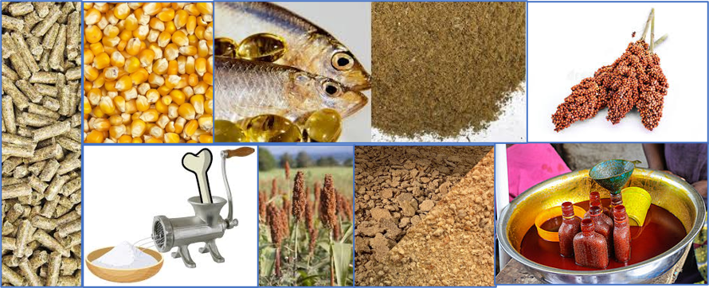

# Quelques définitions

##	Aliment pour animaux

Toute substance (d’un ou plusieurs **ingrédients**) transformée, semi-transformée ou brute, destinée à l’alimentation directe d’animaux (dont les produits sont destinés à la consommation humaine).

##	Ingrédient d’aliment pour animaux

Élément ou constituant de tout mélange destiné à l’alimentation animale, qu’il ait ou non une valeur nutritionnelle dans le régime alimentaire de l’animal, y compris les **additifs**.

l'ingrédient peut être d’origine végétale, animale, aquatique ou tout autre substance organique ou inorganique. La **figure 3.1** présente certains aliments (ingrédients d’aliments) pour animaux.

##	Additif d’aliment pour animaux

Tout **ingrédient** ajouté intentionnellement, qui n’est pas normalement consommé sous forme d’aliment pour animaux, qu’il ait ou non une valeur nutritive, affectant les caractéristiques du mélange ou des produits d’origine animale.

Les **micro-organismes**, **enzymes**, **régulateurs d’acidité**, **oligo-éléments**, **vitamines** et autres produits sont englobés dans cette définition selon l’usage qu’il en est fait et le mode d’administration.

## Pesticide

Substance destinée à prévenir, détruire, attirer, repousser ou combattre tout élément nuisible, y compris toute espèce indésirable de plantes ou d’insecte pendant la production, le stockage, le transport, la distribution et la préparation d’aliments, de denrées agricoles ou de produits pour l’alimentation animale, ou pouvant être administrée aux animaux comme traitement ectoparasitaire.

## Substance indésirable

**Contaminant** et autres substances présents dans et/ou sur les aliments et leurs ingrédients, et qui constituent un risque pour la santé des consommateurs, y compris les problèmes de santé animale (liés à la sécurité sanitaire des aliments destinés à la consommation humaine)

## Contaminant

Tout **agent biologique** ou **chimique**, toute **matière étrangère** ou toute autre substance n'étant pas ajoutée intentionnellement aux produits alimentaires et pouvant compromettre la **sécurité** ou la **salubrité**. 

> Toute substance qui n’est pas intentionnellement ajoutée à la denrée alimentaire, mais qui est cependant présente dans celle-ci comme un résidu de la production (y compris les traitements appliqués aux cultures et au bétail et dans la pratique de la médecine vétérinaire), de la fabrication, de la transformation, de la préparation, du traitement, du conditionnement, de l'emballage, du transport ou du stockage de ladite denrée, ou à la suite de la contamination par l'environnement.

L'expression ne s'applique pas aux débris d'insectes, poils de rongeurs et autres substances étrangères.

##	Médicament vétérinaire

Toute substance appliquée ou administrée à des animaux producteurs de nourriture, tels que race de boucherie ou laitière, volaille, poissons ou abeilles, qu’elle soit utilisée dans un but thérapeutique, prophylactique ou diagnostique, ou en vue de modifier des fonctions physiologiques ou le comportement.

##	Pathogène/maladie zoonotique

Pathogène/maladie ou infection naturellement transmissible des animaux vertébrés à l’homme et vice versa.

Les pathogènes en cause peuvent être des bactéries, des virus ou des parasites. La transmission de ces maladies se fait soit directement, lors d'un contact entre un animal et un être humain, soit indirectement par voie alimentaire ou par l’intermédiaire d'un vecteur (insecte, arachnides, etc.).

D'après l'Organisation mondiale de la santé animale ([OIE, 2020](https://www.oie.int/fr/pour-les-medias/une-seule-sante/)), 60% des maladies infectieuses humaines sont zoonotiques.

##	Risque

Fonction de la probabilité d’un effet adverse pour la santé et de sa gravité, du fait de la présence d’un danger dans un aliment.

##	Danger

Agent biologique, chimique ou physique présent dans un aliment, ou propriété de cet aliment, pouvant avoir un effet nocif.

##	Identification des dangers

Identification des agents biologiques, chimiques et physiques susceptibles de provoquer des effets adverses pour la santé et qui peuvent être présents dans un aliment donné ou un groupe d’aliments.

##	Traçabilité

Capacité à suivre le mouvement d’une denrée alimentaire à travers une ou des étapes spécifiées de la production, de la transformation et de la distribution.

