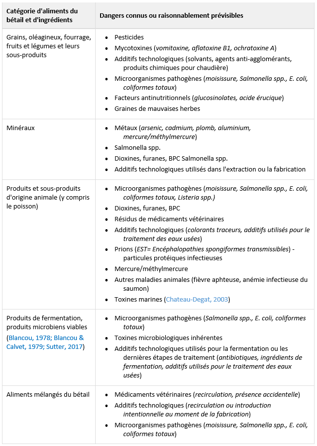

# Dangers préoccupants courants selon la catégorie d'ingrédients et d'aliments{#dangers}

« Les **métaux lourds**, les **dioxines**, les **furanes**, les **BPC**, les **résidus de médicaments vétérinaires**, les **résidus de pesticides**, les **additifs technologiques**, les **mycotoxines** et les **contaminants microbiens** » sont parmi les contaminants préoccupants les plus courants.

Il est proposé d'exiger au minimum que les dangers indiqués au **tableau 5.1** suivant, et considérés comme des **dangers connus** ou **raisonnablement prévisibles** dans les aliments du bétail et les ingrédients connexes, soient pris en considération dans le processus d'identification et d'évaluation des risques. 

Ce tableau est une liste non exhaustive des dangers selon la catégorie d'aliments du bétail et d'ingrédients, et doit être utilisé en fonction des procédés de fabrication de chacun.

**Tableau 5.1** Dangers préoccupants courants selon la catégorie d'aliments et d'ingrédients

